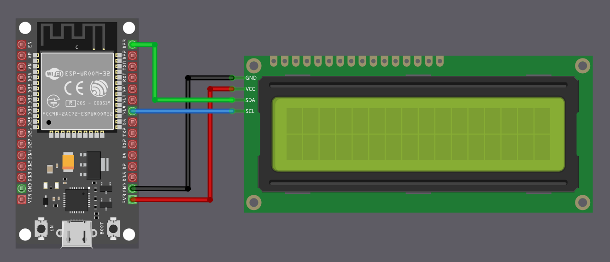
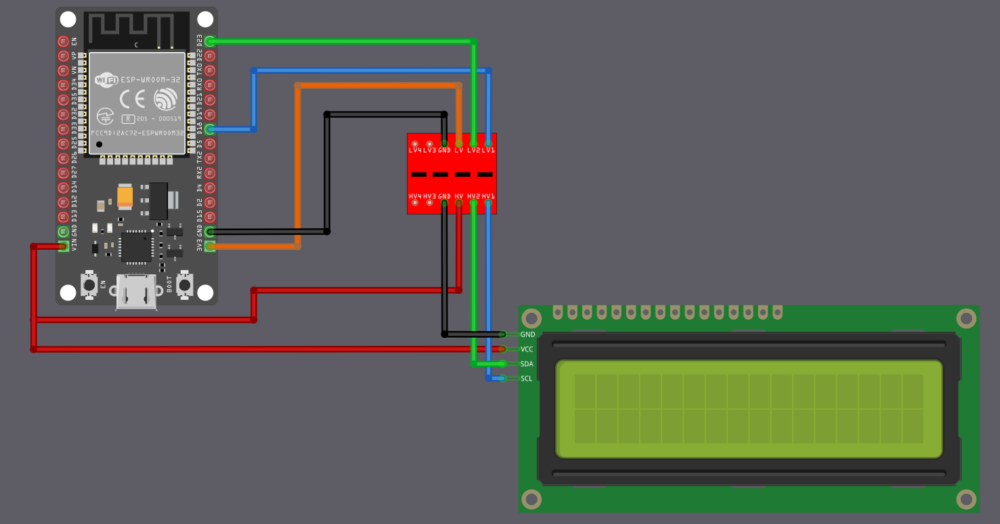

# Connecting LCD Display (LCD1602) to the ESP32

We are going to connect an LCD1602 character display fitted with an I2C adapter to the ESP32. From a wiring point of view, the setup looks simple because only four connections are required: power, ground, SDA, and SCL. However, even though the wiring count is small, there is an important voltage detail that we must handle correctly before making any connections.

## Voltage compatibility problem

The voltage tolerance of ESP32 GPIO pins is 3.6 V. If the voltage on a GPIO pin exceeds 3.6 V, it is outside the safe operating range and may cause damage to the chip.

Most LCD1602 modules with an I2C backpack are designed to run at 5 V. The I2C backpack usually has pull-up resistors connected to its supply voltage. When powered at 5 V, this means SDA and SCL idle at 5 V.

If SDA and SCL from such a module are connected directly to the ESP32, the ESP32 GPIO pins will be exposed to 5 V. This is the core problem we must address.

## A commonly suggested shortcut you will see online

Many online tutorials suggest powering the LCD1602 and its I2C backpack from 5 V and connecting SDA and SCL directly to the ESP32. I have tested this setup myself, and it does work. However, it is electrically unsafe, and long-term use might damage the ESP32 GPIO pins.

For this reason, even though it functions, this wiring method should not be considered safe or recommended.

> [!Note]
> This topic is frequently discussed in the ESP32 community. Some users report that 5 V inputs appear to work in hobby projects, while others point out that this behavior is not specified by Espressif and should not be relied on, especially for commercial or long-term designs. One of the related discussions can be found here:
> [https://www.reddit.com/r/esp32/comments/1j5p0lb/can_the_espwroom32_read_5v_io_inputs/](https://www.reddit.com/r/esp32/comments/1j5p0lb/can_the_espwroom32_read_5v_io_inputs/)

## The lazy but reasonably safe approach: power everything at 3.3 V

For demos, experiments, and learning projects, the simplest and safest approach is to power the LCD1602 I2C module from the ESP32 3.3 V supply instead of 5 V.

When the LCD backpack is powered at 3.3 V, its I2C pull-up resistors pull SDA and SCL to 3.3 V instead of 5 V. This immediately removes the voltage compatibility problem, and SDA and SCL can be connected directly to the ESP32.

The trade-off is reduced LCD contrast and backlight brightness. When powered at 3.3 V, the display is typically still readable under normal indoor lighting conditions, which is sufficient for experiments and basic verification.

This approach avoids extra components and avoids stressing the ESP32 GPIO pins.

<table>
  <thead>
    <tr>
      <th style="width: 250px;">LCD Pin</th>
      <th style="width: 250px; text-align: center;">Wire</th>
      <th>ESP32 Pin</th>
      <th>Notes</th>
    </tr>
  </thead>
  <tbody>
    <tr>
      <td>GND</td>
      <td style="text-align: center; vertical-align: middle; padding: 0;">
        

          

          

        

      </td>
      <td>GND</td>
      <td>Ground</td>
    </tr>
    <tr>
      <td>VCC</td>
      <td style="text-align: center; vertical-align: middle; padding: 0;">
        

          

          

        

      </td>
      <td>3.3</td>
      <td>3.3 Power Supply</td>
    </tr>
    <tr>
      <td>SCL</td>
      <td style="text-align: center; vertical-align: middle; padding: 0;">
        

          

          

        

      </td>
      <td>GPIO 18</td>
      <td>Connects the clock signal (SCL) for I2C communication.</td>
    </tr>
    <tr>
      <td>SDA</td>
      <td style="text-align: center; vertical-align: middle; padding: 0;">
        

          

          

        

      </td>
      <td>GPIO 23</td>
      <td>Connects the data signal (SDA) for I2C communication.</td>
    </tr>
  </tbody>
</table>
 

## Best approach: Using a level shifter

If you need full backlight brightness, or if your LCD module does not work reliably at 3.3 V, then you must power it at 5 V. But this means you need to protect the ESP32 from the 5 V signals.

The solution is a bidirectional logic level converter (also called a level shifter). This small module converts signals between 3.3 volts and 5 volts in both directions.

The ESP32 connects to the 3.3 V side of the level shifter, and the LCD connects to the 5 V side. The level shifter makes sure the ESP32 only ever sees 3.3 V signals, while the LCD gets the 5 V signals it needs.

This is the electrically correct and safe method, but it adds a few extra wires and requires an additional module.

 

The circuit diagram may look a little confusing at first glance, but the idea is simple once you break it down.

<h3>Power Connections (Connect These First)</h3>

First, connect the ESP32 3.3 V output to the pin marked LV (Low Voltage) on the level shifter. This defines the logic level for the ESP32 side. Next, connect the ESP32 5 V supply (i.e VIN in ESP32 Devkit V1 board) to the pin marked HV (High Voltage) on the level shifter. The LCD VCC pin is also powered from this same 5 V supply.

Ground must be common, so connect ESP32 GND, the level shifter GND, and the LCD GND together.

<table>
  <thead>
    <tr>
      <th style="width: 180px;">From</th>
      <th style="width: 120px;">Pin</th>
      <th style="width: 160px; text-align: center;">Wire</th>
      <th style="width: 180px;">To</th>
      <th style="width: 120px;">Pin</th>
      <th>Purpose</th>
    </tr>
  </thead>
  <tbody>
    <tr>
      <td>ESP32</td>
      <td>GND</td>
      <td style="text-align: center; padding: 0;">
        

          

          

        

      </td>
      <td>Level Shifter</td>
      <td>GND</td>
      <td>Common ground</td>
    </tr>
    <tr>
      <td>Level Shifter</td>
      <td>GND</td>
      <td style="text-align: center; padding: 0;">
        

          

          

        

      </td>
      <td>LCD Display</td>
      <td>GND</td>
      <td>Common ground</td>
    </tr>
    <tr>
      <td>ESP32</td>
      <td>3.3V</td>
      <td style="text-align: center; padding: 0;">
        

          

          

        

      </td>
      <td>Level Shifter</td>
      <td>LV</td>
      <td>Low voltage logic reference</td>
    </tr>
    <tr>
      <td>ESP32</td>
      <td>VIN / 5V</td>
      <td style="text-align: center; padding: 0;">
        

          

          

        

      </td>
      <td>Level Shifter</td>
      <td>HV</td>
      <td>High voltage logic reference</td>
    </tr>
    <tr>
      <td>ESP32</td>
      <td>VIN / 5V</td>
      <td style="text-align: center; padding: 0;">
        

          

          

        

      </td>
      <td>LCD Display</td>
      <td>VCC</td>
      <td>5V power supply for the LCD</td>
    </tr>
  </tbody>
</table>

<h3>Data Connections (I2C Communication)</h3>

Now connect the I2C signal lines. The ESP32 GPIO pins must always connect to the pins on the level shifter marked LVx, and the LCD I2C pins must connect to the corresponding pins marked HVx.

In this example, the ESP32 SDA pin connects to LV1, and the LCD SDA pin connects to HV1. The ESP32 SCL pin connects to LV2, and the LCD SCL pin connects to HV2. The exact GPIO numbers used for SDA and SCL depend on your ESP32 board and software configuration. 

<table>
  <thead>
    <tr>
      <th style="width: 180px;">From</th>
      <th style="width: 120px;">Pin</th>
      <th style="width: 160px; text-align: center;">Wire</th>
      <th style="width: 180px;">To</th>
      <th style="width: 120px;">Pin</th>
      <th>Purpose</th>
    </tr>
  </thead>
  <tbody>
    <tr>
      <td>ESP32</td>
      <td>GPIO 23 (SDA)</td>
      <td style="text-align: center; padding: 0;">
        

          

          

        

      </td>
      <td>Level Shifter</td>
      <td>LV1</td>
      <td>SDA (Data) - ESP32 side</td>
    </tr>
    <tr>
      <td>Level Shifter</td>
      <td>HV1</td>
      <td style="text-align: center; padding: 0;">
        

          

          

        

      </td>
      <td>LCD Display</td>
      <td>SDA</td>
      <td>SDA (Data) - LCD side</td>
    </tr>
    <tr>
      <td>ESP32</td>
      <td>GPIO 18 (SCL)</td>
      <td style="text-align: center; padding: 0;">
        

          

          

        

      </td>
      <td>Level Shifter</td>
      <td>LV2</td>
      <td>SCL (Clock) - ESP32 side</td>
    </tr>
    <tr>
      <td>Level Shifter</td>
      <td>HV2</td>
      <td style="text-align: center; padding: 0;">
        

          

          

        

      </td>
      <td>LCD Display</td>
      <td>SCL</td>
      <td>SCL (Clock) - LCD side</td>
    </tr>
  </tbody>
</table>

### How it works
 
In simple terms, when the ESP32 communicates over an I2C line, the LVx side operates at 3.3 V, and the level shifter presents a 5 V signal on the matching HVx side for the LCD. When the LCD communicates at 5 V, the level shifter translates that signal back so the ESP32 only ever sees 3.3 V on the LVx side. This way, both devices operate at their required voltages without stressing the ESP32 GPIO pins.
